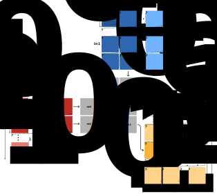

.. _ch:xdna2-kernel:

XDNA2 Kernel
============

While all optimization objectives stated in the :ref:`ch:xdna1` chapter remain valid, transferring BFP16 data is more complex than transferring BF16 data.
Therefore, we use a different L1 data layout to account for the pipelined BFP16 loads and stores described in the :ref:`XDNA2 ISA section <xdna2:infer-isa>`.

.. _xdna2-l1-data-layout:

L1 Data Layout
--------------

   Data layout of the tensor contraction kernel in the L1 scratchpad memory of an executing compute tile.
   The kernel computes ``[m2,k1,m1,m0,k0],[n2,k1,n1,n0,k0]->[m1,m2,n2,n1,m0,n0]``, with fixed sizes ``|m0|=8``, ``|k0|=8``, ``|n0|=8``, ``|m1|=2``, and ``|n1|=2``.
   The first computation of a 2×2 block of output tiles is highlighted in darker colors.

:numref:`xdna2_kernel:l1_data_layout` illustrates the data layout of the BFP16 tensor contraction kernel with FP32 accumulation: ``[m2,k1,m1,m0,k0],[n2,k1,n1,n0,k0]->[m1,m2,n2,n1,m0,n0]``.
The tensors are tiled based on the BFP16 VMAC.F operation requirements, meaning that all three tensors use 8×8 tiles.
In detail, ``in0`` has tiles of size ``|m0|``\ ×\ ``|k0|``, ``in1`` of size ``|n0|``\ ×\ ``|k0|``, and ``out`` of size ``|m0|``\ ×\ ``|n0|``, where ``|m0|=8``, ``|k0|=8``, and ``|n0|=8``.
A BFP16 input tile, that is, a tile of either ``in0`` or ``in1``, has a size of 72 bytes.
An FP32 tile of ``out`` has a size of 256 bytes.

Given that XDNA2 has only five accumulation registers, the kernel employs a 2×2 register blocking for the output tensor.
This blocking is described by the dimensions ``m1`` and ``n1`` with ``|m1|=2`` and ``|n1|=2`` in the einsum.
:numref:`xdna2_kernel:l1_data_layout` shows the accumulator blocking in gray, using two accumulation registers (``DM0`` and ``DM1``), each accumulating two tiles.
The :ref:`kernel design <xdna2-kernel:alternating-registers>` section gives a detailed explanation of the mapping of four output tiles to two accumulation registers.

The L1 data layout is more complex due to potential bank conflicts.
Specifically, XDNA2 has a total of four logical memory banks.
We assign one of the banks to ``in0`` and another one to ``in1``.
This leaves two banks for loading and storing the output tensor ``out``.
To fully utilize both banks, our L1 data layout evenly distributes the output tensor across the two banks.
Accordingly, ``m1`` is the outermost dimension of the output tensor, where the slice with ``m1=0`` is placed on one bank and the slice with ``m1=1`` on the other.

The sizes of the remaining dimensions ``m2``, ``n2``, and ``k1`` are flexible but must be chosen so that the tensors fit into the L1 scratchpad.

.. _xdna2-design:

Design
------
As discussed in the :ref:`previous section <xdna2-l1-data-layout>`, our L1 data layout can be expressed by the einsum ``[m2,k1,m1,m0,k0],[n2,k1,n1,n0,k0]->[m1,m2,n2,n1,m0,n0]`` with the fixed sizes ``|m0|=8``, ``|k0|=8``, ``|n0|=8``, ``|m1|=2``, and ``|n1|=2``.
Similar to the XDNA1 kernel, the VMAC.F operation consumes the dimensions ``m0``, ``k0``, and ``n0``.
Dimensions ``m1`` and ``n1`` represent our accumulator blocking.
The sizes of ``m2``, ``k1``, and ``n2`` remain to be selected.

Before discussing the design decisions of our XDNA2 tensor contraction kernel, we summarize key hardware properties that must be considered:

1. Loading data into a 256-byte accumulation register requires four 64-byte loads.
   VLDA can load directly into the accumulation registers.
   However, VLDB can only load into vector registers.
   Each load has a latency of seven cycles.
   A VMOV operation copies 64 bytes from a vector register into an accumulation register and has a latency of two cycles.
2. VMAC.F reads from the accumulation register in its fourth cycle (forwarding).
3. Properties 1 and 2 allow us to formulate scheduling rules when a VMAC.F operation depends on loads to the accumulation register.
   Specifically, we can issue a VMAC.F operation at the earliest in the fifth cycle of the fourth 64-byte load.
   In other words, the last load and the dependent VMAC.F must be four cycles apart.
4. Loading a 72-byte vector register requires one VLDA.POP or VLDB.POP from a pre-filled load pipeline.
   This load has an 8-cycle latency.
5. A VMAC.F operation has a latency of six cycles.

Output Stationary
  See :ref:`xdna1-kernel:design-output-stationary` in the XDNA1 kernel design.

.. _xdna2-kernel:register_blocking:

Register Blocking
  Dimensions ``m1`` and ``n1`` are handled by a 2×2 register blocking; therefore, ``|m1|=|n1|=2``.

Streaming of Input Tiles
  The L1 data layout stores the input tiles of ``in0`` in ``k1``\ ×\ ``m1`` blocks and the tiles of ``in1`` in ``k1``\ ×\ ``n1`` blocks.
  Thus, for the computation of a 2×2 block of output tiles, we can use one linear stream (using VLDA) to load the data of ``in0`` and one (using VLDB) to load the data of ``in1``.
  The highest performance is obtained when consecutively loading eight 72-byte tiles.
  Additionally, the loads and stores must be 64-byte aligned.

.. _xdna2-kernel:buffer-placement:

Bank-Aware Buffer Placement
  We split the output tensor into two parts along the ``m1`` dimension, allowing for simultaneous access to both halves without bank conflict.
  In detail, we place the output tensor in a buffer spanning two consecutive memory banks.
  The first half of the buffer is aligned to the end of the first memory bank, and the second half is aligned to the start of the second bank, forming one contiguous buffer.
  The implementation passes two pointers for ``out``, one per half.

.. _xdna2-kernel:design-linear-contraction:

Linear Contraction Dimension
  As in the :ref:`XDNA1 kernel <xdna1-kernel:design-linear-contraction>`, the ``k1`` dimension is handled with linear code.

.. _xdna2-kernel:alternating-registers:

Accumulation Chains
  XDNA2 has only five 2048-bit accumulation registers.
  Therefore, we cannot use a simple double-buffering scheme for the 2×2 register blocking, which would require eight registers.

  However, the 6-cycle VMAC.F operation only requires valid data in the accumulation register when it reads from the register in the fourth cycle.
  This means that the operation writing the required data to the accumulation register must complete in the third cycle of VMAC.F.
  At all other times, the register may hold unrelated data.
  Assuming that we write the accumulation data for the VMAC.F in the third cycle, we can:

  1. Write unrelated data to the accumulation register in cycles 1--2, and 4--5.
  2. Read unrelated data from the accumulation register in cycles 1--3, and 5--6.

  Thus, VMAC.F operations accumulating in a single output tile must be scheduled at least three cycles apart:

  .. code-block::

   [-- --] [-- --] [-- --] [R0 --] [-- --] [-- W0] [R1 --] [-- --]
      1       2       3       4       5       6       7       8

   [-- W1] [R2 --] [-- --] [-- W2] [R3 --] [-- --] [-- W3] [R4 --]
      9       10      11      12      13      14      15      16

  Here, ``R0`` is the accumulation register read of the first VMAC.F operation, and ``R1``--``R4`` are the reads of the following four operations.
  Correspondingly, ``W0``--``W3`` are the writes.

  In practice, our kernel schedules the VMAC.F accumulation chains with a distance of four cycles:

  .. code-block::

   [-- --] [-- --] [-- --] [R0 --] [-- --] [-- W0] [-- --] [R1 --]
      1       2       3       4       5       6       7       8

   [-- --] [-- W1] [-- --] [R2 --] [-- --] [-- W2] [-- --] [R3 --]
      9       10      11      12      13      14      15      16

  The four-cycle distance allows us to interleave two accumulation chains.
  The second chain has a two-cycle offset:

  .. code-block::

   [-- --] [-- --] [-- --] [-- --] [-- --] [Q0 --] [-- --] [-- P0]
      1       2       3       4       5       6       7       8

   [-- --] [Q1 --] [-- --] [-- P1] [-- --] [Q2 --] [-- --] [-- P2]
      9       10      11      12      13      14      15      16

  This allows us to use the same accumulation register for both chains:

  .. code-block::

   [-- --] [-- --] [-- --] [R0 --] [-- --] [Q0 W0] [-- --] [R1 P0]
      1       2       3       4       5       6       7       8

   [-- --] [Q1 W1] [-- --] [R2 P1] [-- --] [Q2 W2] [-- --] [R3 P2]
      9       10      11      12      13      14      15      16

  We see that we obtain an execution throughput of 1/2 after cycle 6, that is, in every other cycle a VMAC.F operation completes.
  We obtain an execution throughput of 1 by scheduling two additional interleaved chains:

  .. code-block::

   [-- --] [-- --] [-- --] [-- --] [S0 --] [-- --] [U0 T0] [-- --]
      1       2       3       4       5       6       7       8

   [S1 V0] [-- --] [U1 T1] [-- --] [S2 V1] [-- --] [U2 T2] [-- --]
      9       10      11      12      13      14      15      16

  These two interleaved chains have a one-cycle offset compared to the previous one, meaning that we effectively obtain an execution throughput of 1 after cycle 6.

  In summary, to fully utilize the vector unit, our kernel requires two accumulation registers and four accumulation chains.
  We use the remaining three accumulation registers for hiding the L1-register transfers.

.. _xdna2-kernel:hardware-loop:

Single Hardware Loop
  The ``m2`` and ``n2`` iterations are implemented using a single hardware loop.
  As in the :ref:`XDNA1 kernel <xdna1-kernel:design-single-loop>`, the first and last 2×2 blocks of output tiles are computed outside of this loop, forming a warm-up and a cool-down phase.

.. _xdna2-kernel:acc-register-buffering:

Accumulation Register Buffering
  To summarize, given the einsum ``[m2,k1,m1,m0,k0],[n2,k1,n1,n0,k0]->[m1,m2,n2,n1,m0,n0]`` and data layout shown in :numref:`xdna2_kernel:l1_data_layout`, ``m0``, ``k0`` and ``n0`` are consumed by the BFP16 VMAC.F operations.
  ``m1`` and ``n1`` are used for our 2×2 accumulator blocking.
  Dimension ``k1`` is consumed by linear code, meaning that we explicitly write all instructions in code.
  This is analogous to unrolling optimizations in a loop-based optimization context.
  Since ``k0`` and ``k1`` are the only contraction dimensions, after performing all ``k1`` updates, we have fully computed a 2×2 block of output tiles.
  Next, we advance the last two remaining dimensions, ``n2`` and ``m2``, through a :ref:`fused hardware loop <xdna2-kernel:hardware-loop>`, where ``n2`` is the faster dimension.

  When advancing from one 2×2 block of output tiles ``i`` to the next (``i+1``), we must write ``i`` to the L1 scratchpad and load ``i+1``.
  In general, the tensor contraction kernel writes the data of block ``i`` during the computation of block ``i+1`` and reads the accumulator input for ``i+1`` during the computation of ``i``.
  This approach allows us to hide L1-register transfers behind VMAC.F operations.

  We realize this scheme by using the remaining three accumulation registers ``DM2``--``DM4`` for buffering the loads and stores.
  In detail, we issue the loads for the four output tiles of ``i+1`` while computing ``i``.
  This data is buffered in registers ``DM2``--``DM4``.
  ``DM2`` is used for buffering two output tiles.
  Furthermore, we must use 16 VST operations to store the four output tiles of block ``i``.
  For this we also use registers ``DM2``--``DM4`` as buffers and execute the 16 VST operations while computing ``i+1``.
  In this case ``DM2`` is also used for buffering two output tiles.

  A single iteration ``j`` of the fused hardware loop mostly contains VMAC.F operations that compute a single block ``i`` of output tiles.
  However at the beginning of the iteration two operations finish the computation of block ``i-1``, while at the end of the iteration two operations already start computing block ``i+1``.
  In summary, the schedule for these four VMAC.F operations and the accumulation register usage in iteration ``j`` is as follows:

  a. the first two VMAC.F operations finish computing block ``i-1`` and write to ``DM4`` and ``DM2``;
  b. the following two VMAC.F operations begin updating block ``i`` and read from ``DM4`` and ``DM2``, where the corresponding VLDA and VLDB operations have been issued in iteration ``j-1``;
  c. the fourth last and third last VMAC.F operations update block ``i`` and write to registers ``DM2`` and ``DM3`` so that the corresponding stores can be issued in iteration ``j+1``;
  d. the last two VMAC.F operations begin updating block ``i+1`` and read from ``DM2`` and ``DM3``.

  A VMAC.F operation reads from the source accumulation register in its fourth cycle and writes to the destination in its sixth cycle.
  By scheduling the two VMAC.F operations in (a) at most two cycles before their respective counterpart in (b), the reads of the operations in (b) are executed before the writes of the operations in (a).
  The kernels follows an analogous approach for the usage of registers ``DM2`` and ``DM3`` by the VMAC.F operations in (c) and (d).
  In this case the writes of the VMAC.F operations in (c) are performed after the reads of the operations in (d).

.. _xdna2-kernel:out-tile-prio:

Output Tile Prioritization
  As discussed in the paragraph :ref:`xdna2-kernel:hardware-loop`, the tensor contraction kernel ends with a specialized cool-down phase.
  During this phase, the kernel computes the last 2×2 block of output tiles.
  Compared to a "regular" iteration of the hardware loop, we cannot hide the final store operations behind following loop iterations.
  Thus, we prioritize the computation of one output tile, so that the register-L1 transfers are at least partially hidden behind VMAC.F operations of the cool-down phase.

Implementation
--------------

This section discusses the warm-up phase, hardware loop, and cool-down phase of a representative XDNA2 BFP16 :download:`tensor contraction kernel <../../src/tensor_kernel_64x96x64_bfp16_bfp16_fp32.s>`.
As described in sections :ref:`xdna2-l1-data-layout` and :ref:`xdna2-design`, the einsum ``[m2,k1,m1,m0,k0],[n2,k1,n1,n0,k0]->[m1,m2,n2,n1,m0,n0]`` with fixed sizes ``|m0|=|k0|=|n0|=8``, ``|m1|=2``, and ``|n1|=2`` describes the tensor contraction kernel.
We choose ``|m2|=4``, ``|k1|=12``, and ``|n2|=4`` in our example implementation.

Warm-up Phase
^^^^^^^^^^^^^

.. _xdna2-kernel:lst-warm-up:

.. literalinclude:: ../../src/tensor_kernel_64x96x64_bfp16_bfp16_fp32.s
   :caption: Warm-up phase (lines 7-105) of the :download:`XDNA2 kernel <../../src/tensor_kernel_64x96x64_bfp16_bfp16_fp32.s>`.
   :language: asm
   :linenos:
   :lineno-match:
   :lines: 7-105

:numref:`xdna2-kernel:lst-warm-up` shows the kernel's warm-up phase.

During the first eight cycles, the load operations for the first 2×2 block are issued.
Load unit A can write directly into the accumulation registers.
Load unit B can only write into scalar or vector registers.
Thus, we first load to vector registers using load unit B and then copy the data to accumulation registers.
We use accumulation registers ``DM0``--``DM3`` for these "loads".
The VMAC.F operations in lines 39--96 exclusively use ``DM0`` and ``DM1`` as their destination registers.
Thus, registers ``DM2``--``DM4`` can be used to load the next 2×2 block of output tiles, required by the upcoming hardware loop.
We discuss this procedure in more detail as part of the next subsection.

Each instruction in lines 7--29 contains a NOPV operation, hence the vector unit is not used.
All other instructions perform VMAC.F operations.
In summary, 48 of the 65 instructions contain VMAC.F operations.

Hardware Loop
^^^^^^^^^^^^^

.. _xdna2:lst-hardware-loop-setup:

.. literalinclude:: ../../src/tensor_kernel_64x96x64_bfp16_bfp16_fp32.s
   :caption: Hardware loop setup (lines 15-17: chars 132+) of the :download:`XDNA2 kernel <../../src/tensor_kernel_64x96x64_bfp16_bfp16_fp32.s>`.
   :language: asm
   :linenos:
   :lineno-match:
   :lines: 15-17
   :dedent: 131

The hardware loop setup follows the procedure outlined in the :ref:`XDNA1 kernel <xdna1:imp-hardware-loop>`.
The respective configuration operations are shown in :numref:`xdna2:lst-hardware-loop-setup`.

.. _xdna2:lst-hardware-loop-body:

.. literalinclude:: ../../src/tensor_kernel_64x96x64_bfp16_bfp16_fp32.s
   :caption: Body of the loop (lines 107-187) in the :download:`XDNA2 kernel <../../src/tensor_kernel_64x96x64_bfp16_bfp16_fp32.s>`.
   :language: asm
   :linenos:
   :lineno-match:
   :lines: 107-187

:numref:`xdna2:lst-hardware-loop-body` shows the body of hardware loop in the XDNA2 tensor contraction kernel.
Lines 110 and 111 contain the two VMAC.F operations discussed as (a) in the :ref:`accumulation register buffering <xdna2-kernel:acc-register-buffering>` part of the kernel design.
(b) is given by lines 115 and 116, (c) by lines 179 and 180, and (d) by lines 184 and 187.

Assuming that the hardware loop currently performs iteration ``j``, then the VLDA and VLDB operations in lines 139--145 and lines 162--164 load three output tiles of the next 2×2 block.
The VLDA operations directly load into ``DM2`` and ``DM3``, while the VLDB operations first load into vector registers.
The data in the vector registers is then copied to ``DM4``.

The two VLDB operations in lines 162 and 163 load the first 128 bytes of the fourth 256-byte output tile to vector registers ``X6`` and ``X7``.
This data is ultimately used by the VMAC.F operation in line 116 when performing iteration ``j+1``.
The corresponding copies from ``X6`` and ``X7`` to the lower half of accumulation register ``DM2`` are done by the two ``VMOV`` operations in lines 111 and 115.
The remaining upper 128 bytes of the fourth tile (``DM2``) are loaded by the two VLDA operations in lines 184 and 187.
Note that the L1-to-``DM2`` transfers of the fourth tile are scheduled to fulfill two conditions:

* First, they are scheduled so that the first output tile in ``DM2`` of the current 2×2 block has been written to L1.
  The last update to the first tile is performed in the VMAC.F operation in line 179.
  This tile is stored in lines 115--120 of the next iteration.
* Second, they are scheduled so that the fourth output tile of the current 2×2 block is stored in ``DM2`` before the VMAC.F operation in line 116 reads it.

In summary, each of the 48 instructions in the loop body contains a VMAC.F operation.
Thus, the vector unit is fully utilized.

Cool-down Phase
^^^^^^^^^^^^^^^

.. _xdna2:lst-cool-down-phase:

.. literalinclude:: ../../src/tensor_kernel_64x96x64_bfp16_bfp16_fp32.s
   :caption: Cool-down phase (lines 189-279) of the :download:`XDNA2 kernel <../../src/tensor_kernel_64x96x64_bfp16_bfp16_fp32.s>`.
   :language: asm
   :linenos:
   :lineno-match:
   :lines: 189-279

:numref:`xdna2:lst-cool-down-phase` shows the kernel's cool-down phase.
To realize the discussed :ref:`output tile prioritization <xdna2-kernel:out-tile-prio>`, each VMAC.F chain after line 228 uses a different accumulation register.
The stores of the last 2×2 block are performed in lines 261--278.

In summary, 48 out of 63 instructions contain VMAC.F operations.

Kernel Efficiency
-----------------

The vector unit utilization of the three parts is as follows:

* Warm-up phase: 48 out of 65 instructions contain VMAC.F operations.
* Hardware loop: All 48 instructions in the loop body contain VMAC.F operations. The loop executes 14 times, yielding a total of 672 instructions with a VMAC.F operation.
* Cool-down phase: 48 out of 63 instructions contain VMAC.F operations.

In summary, the kernel executes 800 instructions, 768 of which contain VMAC.F operations.
This results in a theoretical utilization of 96%.
In other words, a compute tile running at 1.8 GHz would execute 1.73×10⁹ BFP16 8×8×8 operations per second.
This equates to a theoretical throughput of 1769 BFP16 GFLOPS.

Analogous to the XDNA1 tensor contraction kernel, we have written a benchmark that calls the tensor contraction kernel repeatedly in a loop on the NPU.
We have benchmarked the kernel on an XDNA2 NPU (AMD Ryzen AI Max PRO 390) and achieved a throughput of 1760 BFP16 GFLOPS.
The benchmarking code is available from our `xdna <https://github.com/scalable-analyses/xdna>`__ repository.
To run the benchmark, execute the following commands:

.. code-block:: bash

   git clone https://github.com/scalable-analyses/xdna
   cd xdna
   make run

.. note::
   The installation of the MLIR-AIE compiler aiecc and Peano is documented in the `mlir-aie <https://github.com/Xilinx/mlir-aie>`__ repository.
   The Makefile assumes that the environment variable ``PEANO_INSTALL_DIR`` contains the path to Peano and that ``aiecc.py`` is available in the path.
   Use ``xrt-smi configure --pmode turbo`` to set the NPU clock to its maximum frequency.
